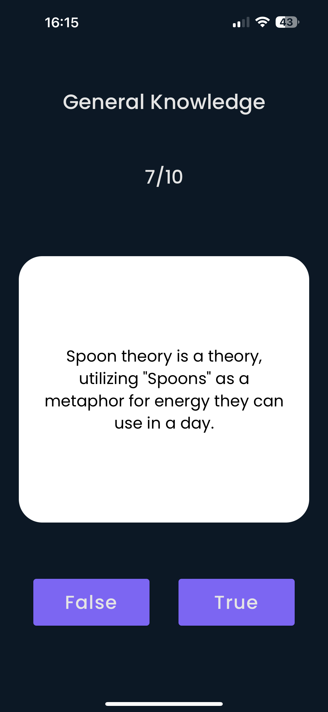
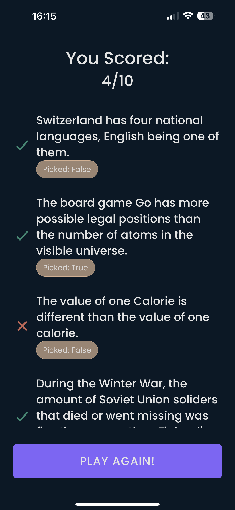

# Trivia - React Native

Mobile application developed with **React Native** and **Expo**. It provides a 10-question trivia game, pulling real-time, hard difficulty, true or false questions directly from the Open Trivia Database API:

[https://opentdb.com/api.php?amount=10&difficulty=hard&type=boolean](https://opentdb.com/api.php?amount=10&difficulty=hard&type=boolean)

## Table of Contents
- [Screenshots](#screenshots)
- [Structure](#structure)
- [Features](#features)
- [Prerequisites](#prerequisites)
- [Dependencies](#dependencies)
- [Installation](#installation)
- [License](#license)

## Screenshots




## Structure
The architectural blueprint for this app closely mirrors the **Atomic Design Pattern**.


- `Core Components`: Essential, reusable building blocks like buttons or text inputs.
- `Components`: Customized mix of core components, fused with specific logic.
- `Containers`: Predefined screen layouts. Here, components come together, shaped by page-specific logic (styles, animations...).
- `Pages`: Deploy containers, manage external logic like API communication (submit, get data...).

## Features
The current application offers:

- **Internationalization**: The application is built to support multiple languages with the `i18next` library

## Prerequisites
Ensure you have met the following requirements:

* You have installed the latest version of:
	*  `yarn`
	* `npx`

## Dependencies
The following major dependencies are used in the project:

- React (`react: 18.2.0`) 
- React Native (`react-native: 0.72.3`) as the main frameworks for building the app interface.
- Expo (`expo: ^49.0.0`, `expo-app-loading: ^2.1.1`, `expo-font: ~11.4.0`, `expo-splash-screen: ~0.20.5`, `expo-status-bar: ~1.6.0`) as the framework for bootstrapping the application.
-  i18next (`i18next: ^20.3.3`) for internationalization.
- Axios (`axios: ^0.21.1`) for making HTTP requests.


## Installation
Describe the installation process. Include the step-by-step process.

```bash
# Clone this repository
$ git clone git@github.com:jtvargas/Trivia.git

# Go into the repository
$ cd Trivia

# Install dependencies
$ yarn install

# Start the server
$ yarn start

```

### Run the app (**Simulator**)

**iOS**
- Run `yarn ios`

**Android**
- Run `yarn android`

### Run the app (**Device**)
This app is made with `Expo` so after start the server (`yarn start`) in the console will prompt a QR Code, you need to scan this code with your device camera.

## License
Copyright 2023 © Jonathan Taveras